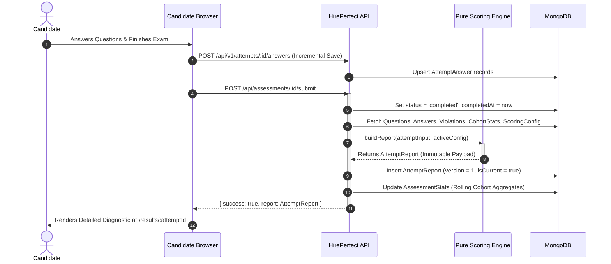

# HirePerfect Assessment Reporting Architecture

## 1. In One Paragraph
A HirePerfect Assessment Report is a defensible, deterministic diagnostic document generated upon candidate submission. It evaluates subject-matter proficiency across categorized sub-topics, analyzes question response times and revision behavior, and presents an independent integrity verification signal from GuardEye AI proctoring. Designed to eliminate opaque single-number scores, every metric is derived from clear rules, backed by statistical suppression gates that prevent noisy reporting, and stored as an immutable, versioned record.

---

## 2. The Journey of an Attempt



---

## 3. What the Score is Based On

### Marking Rules
- **Marks per Correct Answer:** Configurable (default `1.0` point).
- **Negative Marking:** Configurable (default `0.0` points / disabled). Negative marking penalizes risk-taking and creates statistical noise for hiring benchmarks.
- **Marks for Unanswered:** Configurable (default `0.0` points).

### Unanswered vs. Not-Reached
- **Unanswered (Skipped):** A question viewed and reached by the candidate where no option was selected.
- **Not Reached:** Questions never seen by the candidate due to time expiration or auto-submission.

### Worked Calculation Example
Consider an assessment of 30 questions:
- Correct: 24 questions $\times 1.0 = 24.0$ marks
- Incorrect: 4 questions $\times 0.0 = 0.0$ marks
- Unanswered (Skipped): 1 question $\times 0.0 = 0.0$ marks
- Not Reached: 1 question $\times 0.0 = 0.0$ marks

$$\text{Raw Score} = 24.0, \quad \text{Max Score} = 30.0$$
$$\text{Percentage} = \text{round}\left(\frac{24.0}{30.0} \times 100, 1\right) = 80.0\%$$

---

## 4. Proficiency Bands

Proficiency bands classify performance into actionable, descriptive tiers without making arbitrary pass/fail hiring judgments:

| Band | Percentage Range | Definition Shown on Report |
|---|---|---|
| **Expert** | 85.0% – 100% | Strong command across the assessment, including harder questions. |
| **Proficient** | 70.0% – 84.9% | Solid working knowledge with minor gaps. |
| **Developing** | 55.0% – 69.9% | Understands the basics; several areas need work. |
| **Foundational** | 0.0% – 54.9% | Early-stage knowledge in this area. |

---

## 5. Topic Breakdown & Statistical Suppression

Assessments group questions into standardized sub-skills (topics). 

### The Minimum Sample Rule
A topic score built on 1–3 questions is statistically insignificant. Therefore:
- **Threshold:** $\text{minQuestionsPerTopic} = 4$.
- **When $N \ge 4$:** Calculate $\text{Percentage} = \text{round}\left(\frac{\text{Correct}}{\text{Total}} \times 100, 1\right)$.
- **When $N < 4$:** Suppress the percentage ($\text{percentage} = \text{null}$), set `lowConfidence: true`, display raw ratio ("2 of 3 correct"), and explain: *"Too few questions to provide a reliable percentage score."*

### Strengths & Gaps
- **Strength:** $\text{Topic Percentage} \ge 80.0\%$ and $N \ge 4$.
- **Gap:** $\text{Topic Percentage} \le 50.0\%$ and $N \ge 4$.
- If no topic qualifies, the report displays: *"No clear pattern across topics in this attempt."*

---

## 6. Timing & Behavioral Analysis

Response times are derived strictly from server-side interaction timestamps:

1. **Median Response Time:** Median of all recorded question durations.
2. **Rushed Answers:** Answered in under $8\text{ seconds}$ (`rushedAnswerSeconds`). The report explicitly pairs this with `rushedIncorrectCount` to highlight guesswork.
3. **Long Dwells:** Questions exceeding $3\times$ the median response time.
4. **Final-Stretch Accuracy:** On assessments with $\ge 20$ questions, compares the accuracy of the final 15% of questions against earlier questions to detect time-pressure deterioration.
5. **Answer Changes:** Tracks answer revision count, separating `changedToCorrect` and `changedToIncorrect`.

---

## 7. Cohort Benchmark & Percentile Rank

Candidate percentiles are computed against completed attempts in the same assessment using standard normal cumulative distribution modeling:

$$z = \frac{X - \mu}{\sigma}, \quad \text{Percentile} = \text{round}(\Phi(z) \times 100)$$

- **Minimum Cohort Gate:** Requires $\ge 30$ completed attempts (`minCohortForPercentile`). Below this threshold, percentiles are suppressed and the actual sample size is displayed.
- **Snapshot Immutability:** The cohort distribution at the exact moment of report generation is saved with the report. An old report's percentile never shifts when future candidates take the test.

---

## 8. GuardEye Integrity Verification

Integrity monitoring and skill evaluation are strictly decoupled:
- **No Score Penalty:** Proctored flags never lower a candidate's skill score or percentage.
- **Objective Classification Tiers:**
  - **Clean:** 0 integrity anomalies detected.
  - **Needs Review:** Minor anomalies present (e.g., brief tab switch or gaze deviation).
  - **Major Issues:** Repeated violations or high-severity events (e.g., multiple faces, secondary device detected).
- **Explicit Coverage Reporting:** The exact monitored duration vs total session duration is printed. If proctoring was interrupted, gaps are stated explicitly.

---

## 9. What the Report Deliberately Does NOT Do

1. **No "Trust-Adjusted" Scores:** We never merge integrity flags into skill percentages.
2. **No Automated Hiring Verdicts:** We provide objective diagnostic evidence; hiring teams make the final human decisions.
3. **No Personality or Psychological Inferences:** We evaluate domain knowledge, not psychology.
4. **No LLM Hallucinations:** Recommendations and feedback are mapped deterministically from validated question-bank focus areas.

---

## 10. Versioning and Recomputation

- **Immutable History:** Published reports are saved as version 1 (`AttemptReport`).
- **Audit-Logged Recomputation:** If a scoring configuration changes or questions are re-evaluated, an admin can trigger a recomputation (`POST /api/v1/admin/attempts/:id/recompute`). This generates `reportVersion: 2`, marks `isCurrent: true`, and updates `supersededBy` on version 1.
- **Reproducibility:** Every report stores `scoringConfigVersion` and `scoringEngineVersion` ('1.0.0').

---

## 11. Configuration Reference (`ScoringConfig`)

```typescript
type ScoringConfig = {
  marksPerCorrect: number;             // Default: 1.0
  negativeMarking: number;             // Default: 0.0
  marksForUnanswered: number;          // Default: 0.0
  difficultyWeighting: boolean;        // Default: false
  difficultyWeights: { easy: 1.0, medium: 1.25, hard: 1.5 };
  passThresholdPercent: number;        // Default: 60.0%
  revealCorrectAnswersToCandidate: boolean; // Default: false
  minQuestionsPerTopic: number;        // Default: 4
  minCohortForPercentile: number;      // Default: 30
  rushedAnswerSeconds: number;         // Default: 8
  longDwellMultiplier: number;         // Default: 3.0
  timePressureTailPercent: number;     // Default: 15
  questionTimeoutSeconds: number;      // Default: 600
};
```

---

## 12. Candidate-Facing Methodology Summary

> *HirePerfect evaluates your answers using objective scoring criteria. Each correct response earns flat marks. Unanswered questions do not deduct marks. Topic performance is highlighted only when enough questions exist to provide statistically meaningful feedback. GuardEye AI proctoring records monitoring signals for reviewer verification, but monitoring events never alter your test score.*

---

## 13. Open Decisions & Roadmap

1. **Topic Tagging Expansion:** 240 default topics have been mapped across all 20 categories. Fine-grained sub-topic taxonomy can be imported using `scripts/sync-topics.ts`.
2. **Headless PDF Rendering:** PDF exports currently use high-fidelity browser print templates; server-side Chromium rendering pipeline can be enabled as volume scales.
3. **Owner Decisions Matrix:** Configurable in database via `Backend/models/ScoringConfig.ts`.
